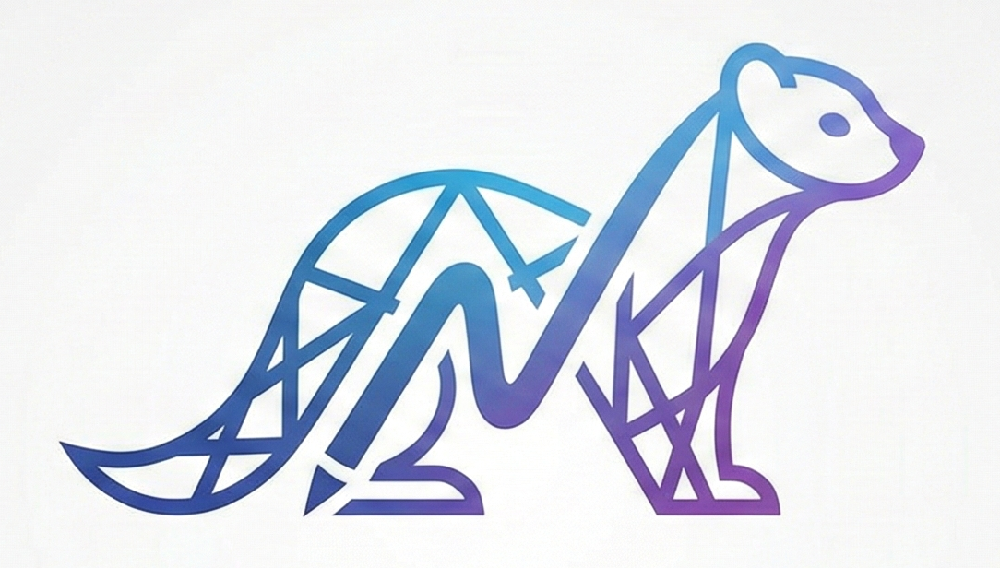

<p align="center">
  
  <p align="center">
    <sup>Image generated with Nano Banana Pro</sup>
  </p>

  <h1 align="center">Mink</h1>

  <p align="center">
    AI Notetaker for Meetings (Open-Source Otter AI Alternative)
  </p>
</p>

## Overview

Mink is a service that lets you upload recordings of meetings, so that you can gather insights, such as
action items, a topic, and a summary, of the meeting. It extracts textual information from the video -- 
transcripts and on-screen text -- and forwards that to an LLM service. This is similar to Otter AI. Zoom
also already has some builtin features for transcripts + LLM. The value is that this is open-source.

Mink does not have any UI or frontend, only offering CLI tool to submit videos and view processing jobs.
However, all meeting data is stored in GCP Cloud SQL which offers an MCP server. That means you can easily
talk to your meeting data with supporting tools such as Claude Desktop.


#### Why I Built This?
This was a 3-day take-home assignment for a job. Therefore, expect a lot of missing features.

## Getting Started

First, clone the repo.

### Demo

> [!CAUTION]
> Do not attempt. The deployment of the demo is currently down.

The easiest way to start is to try the demo. **This requires an API key distributed by me (@rsamf).**

1. Make sure the repo is clone, and change your cwd to the repo directory.
1. Install the CLI
    ```bash
    uv sync
    ```
1. Submit a meeting recording. (Tested on .mp4 files)
    ```bash
    uv run python -m mink.cli <API_KEY> submit <MEETING_FILE>
    ```

In a few seconds or minutes depending on how long the recording is, you will receive your results in 3 terminal pages. First, you'll receive the intelligent notes: topic, summary, and any available action items. Then, you'll see the raw transcript, and then, raw on-screen text.

## Deploy Your Own Mink

### Build

First start building the image with Docker.

1. You can build it like so:
    ```bash
    docker build -t mink .
    ```
    Or, with LightOnOCR support:

    ```bash
    docker build --build-arg sync_options="--all-extras" -t mink .
    ```

This may take awhile, so while it's building, deploy the cloud resources.

### Deploy

The repo provides terraform to host your own Mink services in Google Cloud. The terraform defines the necessary PostgreSQL db Cloud SQL instance and supplementary resources to store the Mink container in Artifact Registry and deploy it in Cloud Run. To deploy your resources:

1. Go to GCP and create a new project
1. Configure terraform/terraform.tfvars with the appropriate values. Note: `db_password` can be anything. Adding an Anthropic API key is optional, so you can leave it blank if you want.
1. Run `terraform init` inside of terraform.
1. Run `terraform apply`.

> [!NOTE]
> At this point, the Cloud Run service will timeout because your container image isn't in Artifact Registry yet. This is fine.

Run `terraform output` to get your artifact registry url, and once your container image is done building, tag and push it to your artifact registry:
```bash
docker tag mink <artifact_registry_url>
docker push <artifact_registry_url>
```

You may need to run `terraform apply` again to have Cloud Run re-pull.

> [!WARNING]
> If you don't set your `hf_token` in [terraform.tfvars](terraform/terraform.tfvars), you may have trouble downloading HF models such as FasterWhisper with Hugging Face's restrictive rate-limiting. You could see something like this:
"HTTP Request: GET https://huggingface.co/api/models/mobiuslabsgmbh/faster-whisper-large-v3-turbo/revision/main "HTTP/1.1 429 Too Many Requests".
If you see that, create a Hugging Face token with read permissions.

## CLI

The CLI provides basic operations to submit meeting recordings and view meetings and jobs.

View helpful information:
```bash
uv run mink/cli.py -h
```

> [!TIP]
> When using the CLI on your own deployed service, you'll have to change the url and the api key. Too see these values, run `terraform output` in the terraform/ directory. Note that the terraform generated a random API key for you to use. You have to see your api key explicitly with `terraform output api_key`.

To submit a video file to your own service:
```bash
uv run python -m mink.cli --url <MINK_SERVICE_URL> <API_KEY> submit <VIDEO_FILE>
```

To view past processing results, you can first look at the meeting by id:
```bash
uv run python -m mink.cli --url <MINK_SERVICE_URL> <API_KEY> meeting <MEETING_ID>
```


Then, view the associated job results:
```bash
uv run python -m mink.cli --url <MINK_SERVICE_URL> <API_KEY> job <JOB_ID>
```
## Config
Mink uses [hydra](https://hydra.cc/docs/intro/) for flexible configuration of the server. All of the config files are located inside of the [config](config) directory. For the deployed service, some values in this directory are overriden in [terraform.tfvars](terraform/terraform.tfvars). However, when running locally, it may be important to pay attention these files. Some important mentions:

*
    For demo purposes, the server has a simple mechanism to restrict access to people that are "invited"
    with an API key. You can write your own api keys (e.g. "password123") into `server.auth.keys` in [config.yaml](config/config.yaml).
    Be creative and supply it with 1 or more API keys.

*
    The container that is running locally will consume [db/localconn.yaml](config/db/localconn.yaml), but the one deployed in Cloud Run will use [db/cloudsql.yaml](config/db/cloudsql.yaml) which will point to the correct environment variables, so don't change that file. To provide localconn.yaml the correct connection info, go to the terraform directory, and run `terraform output`.

* 
    (Optional) You may provide an Anthropic API key to gather meeting insights (i.e. "casting" raw text data to valuable insights). Only Anthropic is supported right now.
    Please, add one in config/cast/anthropic.yaml at `api_key`.


## Run Locally without Docker

If you want to run it without Docker, you can with `uv`. You'll still need a PostgreSQL database as that is required. The terraform is configured to deploy a postgres database in Cloud SQL, so you can just use that. Also, make sure to modify the hydra config. See sections <a href="#config">Config</a> and <a href="#cloud">Cloud</a> for more details.

#### With `uv`

1. Install server dependencies
    ```bash
    uv sync --extra server
    ```
    Or, with LightOnOCR support (Will use EasyOCR by default):
    ```bash
    uv sync --all-extras
    ```

1. Then execute it:
    ```bash
    uv run python -m mink.main
    ```

> [!WARNING]
> You may get a connection error if you haven't deployed the postgres database yet since Mink depends on that to store its data.

## MCP Setup (Optional)
For more advanced usage of Mink, you can integrate it with existing agent platforms such as Claude Desktop. This allows you to conversationally use Mink for viewing meeting information, get even more personalized insights about past meetings, and perform other actions given the meeting information.

1. First, install Google's MCP Toolbox:
https://docs.cloud.google.com/sql/docs/mysql/pre-built-tools-with-mcp-toolbox#install-the-mcp-toolbox
1. Then, configure your choice of LLM system:
https://docs.cloud.google.com/sql/docs/mysql/pre-built-tools-with-mcp-toolbox#configure-the-mcp-client

## Limitations
* No UI or web app
* No integration with Zoom or other meeting platforms
* No user management, no auth. Only has restricted access (to everything)

## Acknowledgments
Thank you to:
* [EasyOCR](https://github.com/JaidedAI/EasyOCR)
* [LightOnOCR](https://huggingface.co/lightonai/LightOnOCR-2-1B)
* [FasterWhisper](https://github.com/SYSTRAN/faster-whisper)
